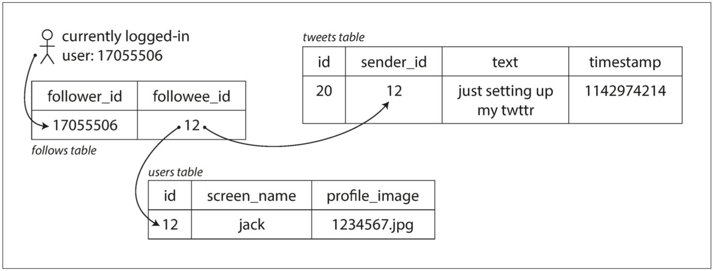
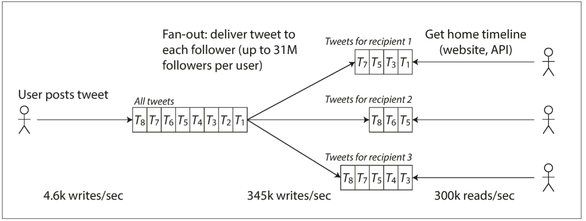

### 人为错误
举个例子，一项关于大型互联网服务的研究发现，运维配置错误是导致服务中断的首要原因。

如何避免人为的不可靠：
- 以最小化犯错机会的方式设计系统。
- 将人们最容易犯错的地方与可能导致失效的地方解耦（decouple）。
- 在各个层次进行彻底的测试。
- 允许从人为错误中简单快速地恢复，以最大限度地减少失效情况带来的影响。
- 配置详细和明确的监控，比如性能指标和错误率。

### 描述负载

在讨论增长问题（如果负载加倍会发生什么？）前，首先要能简要描述系统的当前负载。负载可以用一些称为 **负载参数（load parameters）** 的数字来描述。参数的最佳选择取决于系统架构，它可能是每秒向 Web 服务器发出的请求、数据库中的读写比率、聊天室中同时活跃的用户数量、缓存命中率或其他东西。除此之外，也许平均情况对你很重要，也许你的瓶颈是少数极端场景。

为了使这个概念更加具体，我们以推特在 2012 年 11 月发布的数据为例。推特的两个主要业务是：

* 发布推文

  用户可以向其粉丝发布新消息（平均 4.6k 请求 / 秒，峰值超过 12k 请求 / 秒）。

* 主页时间线

  用户可以查阅他们关注的人发布的推文（300k 请求 / 秒）。

处理每秒 12,000 次写入（发推文的速率峰值）还是很简单的。然而推特的伸缩性挑战并不是主要来自推特量，而是来自 **扇出（fan-out）**[^ii]—— 每个用户关注了很多人，也被很多人关注。

[^ii]: 扇出：从电子工程学中借用的术语，它描述了输入连接到另一个门输出的逻辑门数量。输出需要提供足够的电流来驱动所有连接的输入。在事务处理系统中，我们使用它来描述为了服务一个传入请求而需要执行其他服务的请求数量。

大体上讲，这一对操作有两种实现方式。

1. 发布推文时，只需将新推文插入全局推文集合即可。当一个用户请求自己的主页时间线时，首先查找他关注的所有人，查询这些被关注用户发布的推文并按时间顺序合并。在如 [图 1-2](img/fig1-2.png) 所示的关系型数据库中，可以编写这样的查询：

    ```sql
    SELECT tweets.*, users.*
      FROM tweets
      JOIN users   ON tweets.sender_id = users.id
      JOIN follows ON follows.followee_id = users.id
      WHERE follows.follower_id = current_user
    ```

    

    **图 1-2 推特主页时间线的关系型模式简单实现**

2. 为每个用户的主页时间线维护一个缓存，就像每个用户的推文收件箱（[图 1-3](img/fig1-3.png)）。当一个用户发布推文时，查找所有关注该用户的人，并将新的推文插入到每个主页时间线缓存中。因此读取主页时间线的请求开销很小，因为结果已经提前计算好了。

    

    **图 1-3 用于分发推特至关注者的数据流水线，2012 年 11 月的负载参数**

推特的第一个版本使用了方法 1，但系统很难跟上主页时间线查询的负载。所以公司转向了方法 2，方法 2 的效果更好，因为发推频率比查询主页时间线的频率几乎低了两个数量级，所以在这种情况下，最好在写入时做更多的工作，而在读取时做更少的工作。

然而方法 2 的缺点是，发推现在需要大量的额外工作。平均来说，一条推文会发往约 75 个关注者，所以每秒 4.6k 的发推写入，变成了对主页时间线缓存每秒 345k 的写入。但这个平均值隐藏了用户粉丝数差异巨大这一现实，一些用户有超过 3000 万的粉丝，这意味着一条推文就可能会导致主页时间线缓存的 3000 万次写入！及时完成这种操作是一个巨大的挑战 —— 推特尝试在 5 秒内向粉丝发送推文。

在推特的例子中，每个用户粉丝数的分布（可能按这些用户的发推频率来加权）是探讨可伸缩性的一个关键负载参数，因为它决定了扇出负载。你的应用程序可能具有非常不同的特征，但可以采用相似的原则来考虑它的负载。

推特轶事的最终转折：现在已经稳健地实现了方法 2，推特逐步转向了两种方法的混合。大多数用户发的推文会被扇出写入其粉丝主页时间线缓存中。但是少数拥有海量粉丝的用户（即名流）会被排除在外。当用户读取主页时间线时，分别地获取出该用户所关注的每位名流的推文，再与用户的主页时间线缓存合并，如方法 1 所示。这种混合方法能始终如一地提供良好性能。在 [第十二章](ch12.md) 中我们将重新讨论这个例子，这在覆盖更多技术层面之后。

### 描述性能
> 延迟和响应时间
> 延迟（latency） 和 响应时间（response time） 经常用作同义词，但实际上它们并不一样。响应时间是客户所看到的，除了实际处理请求的时间（ 服务时间（service time） ）之外，还包括网络延迟和排队延迟。延迟是某个请求等待处理的 持续时长，在此期间它处于 休眠（latent） 状态，并等待服务。

即使不断重复发送同样的请求，每次得到的响应时间也都会略有不同。现实世界的系统会处理各式各样的请求，响应时间可能会有很大差异。因此我们需要将响应时间视为一个可以测量的数值 分布（distribution），而不是单个数值。