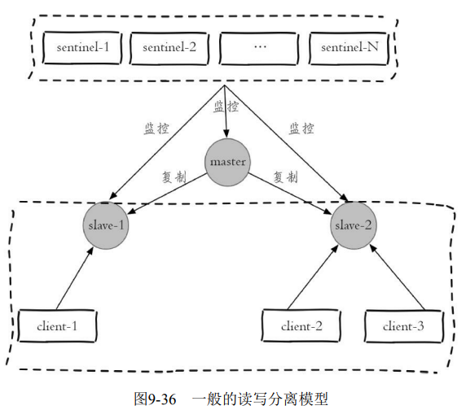
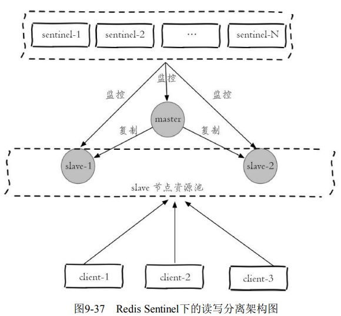

#### 3.1 慢查询分析
redis会记录慢查询日志，慢查询只统计命令执行的时间，而不包含发送命令、命令排队时间。所以没有慢查询并不代表客户端没有超时时间。

#### 3.3 Pipeline
可以用Pipeline模拟出批处理操作，但有区别：1.原生批量命令是原子的，Pipeline是非原子的。2.原生批量命令是一个命令对应多个key，Pipeline支持多个命令。
Pipeline组装的命令个数不能没有限制，否则会增加客户端的等待时间并且网络阻塞，这种情况可以拆分成多个Pipeline。

#### 3.4 事务与Lua
Redis提供简单的事务功能，可以使一组命令顺序地原子执行，但不支持回滚。如果命令错误，则整个事务无法执行。运行时错误，则无法进行回滚，需要由开发人员修复。

#### 3.5 Bitmaps
`bitop op destkey key[key....]` bitop是一个复合操作，它可以做多个Bitmaps的交集、并集、非、异或操作并将结果保存在destkey中。
比如用bitmaps存某一个对应userid是否访问网站，那么两天的交集就是两天都访问过网站的用户数量。如果想知道两天任意一天都访问过网站的用户数量，就可以使用并集。

#### 3.6 HyperLogLog
适用于：1. 只为了计算独立总数（对key进行add\count\merge），不需要获取单条数据。2. 可以容忍一定误差率。

#### 6.4.4 规避复制风暴
如何理解“由于Redis的单线程架构，通常单台机器会部署多个Redis实例。当一台机器（machine）上同时部署多个主节点（master）时”中的多个实例？为什么一台机器可以有多个主节点？主节点不一般只有一个？
> GTP-4:首先，让我们来理解什么是一个“实例”。在计算机科学中，一个实例通常指代的是一个程序或者服务的运行版本。对于Redis来说，一个实例就是一个运行在特定端口上的Redis服务器。你可以启动多个不同端口的Redis服务器（即实例），每个都独立运行，互不影响。
接下来，我们需要明确“主节点”这个概念。当我们谈到分布式系统，特别是那些使用主-从复制模型的系统时，主节点一般指的是数据复制过程中的源头，也就是那个持有原始数据并且负责对其他节点进行更新的节点。在这样的模型下，一个主节点可以有多个从节点。
在Redis集群模式下，每一个Redis节点都可以是一个主节点，有其自身的从节点。不同的主节点间可能存储不同的数据，并且它们各自管理着自己的从节点进行数据的复制。所以说，在一个Redis集群中，可以有多个主节点存在。
至于为什么一台机器上可以同时部署多个主节点，这其实是出于性能和资源利用的考量。因为Redis是单线程的，所以无论机器的CPU核心数有多少，Redis只能使用其中的一个。如果我们在一台多核服务器上只运行一个Redis实例，那么就会浪费大量的CPU资源。解决这个问题的一个方法就是在同一台服务器上运行多个Redis实例，这样就可以充分利用多核CPU，提高了整体的处理能力。
最后，虽然一台机器上可以部署多个主节点，但这并不意味着这种情况在所有场景下都是理想的。这样会将多个主节点的命运与一台机器绑定，如果该机器发生故障，可能会影响到集群的正常工作。因此，具体是否要在一台机器上部署多个主节点，需要根据应用需求和硬件环境等多个因素来综合考虑。

#### 8.3.2 缩减键值对象
key长度：在设计键时，在完整描述业务情况下，键值越短越好。如`user:{uid}:friends:notify:{fid}`可以简化为`u:{uid}:fs:nt:{fid}`。

#### 8.3.6 控制键的数量
“对于存储相同的数据内容利用Redis的数据结构降低外层键的数量，也可以节省大量内存“这句话怎么理解?

GPT4
这句话的意思是，如果我们能够有效地利用Redis提供的数据结构来存储数据，我们可以减少使用外层键，从而节省大量内存。
让我们以一个具体的例子来说明这个概念。假设你有一组用户数据，每个用户都有自己的名字、年龄和电子邮件地址。一种简单的方法是为每个用户创建一个键，如下所示：
```
"user:1:name" -> "Alice"
"user:1:age" -> "30"
"user:1:email" -> "alice@example.com"
"user:2:name" -> "Bob"
"user:2:age" -> "25"
"user:2:email" -> "bob@example.com"
```
在这种情况下，每个用户需要3个键来存储他们的信息。但是，如果我们使用Redis的散列数据结构，我们可以将所有用户的信息存储在一个单独的键中：
```
"user:1" -> {"name": "Alice", "age": "30", "email":"alice@example.com"}
"user:2" -> {"name": "Bob", "age": "25", "email":"bob@example.com"}
```
现在，每个用户只需要一个键就可以存储他们的信息。这样做不仅降低了键的数量，也节省了内存。这就是你引述的语句要表达的意义。

### 9.5 哨兵实现原理
- 主观下线和客观下线：哨兵节点集合需要判断数据节点是否下线，主观下线是哨兵节点通过心跳机制判断某节点下线，客观下线是当哨兵节点发现主观下线的节点是主节点时，会在哨兵节点中发起投票，通过majority在哨兵节点集合中判断是否下线。
- 哨兵节点选主：哨兵节点集合通过raft选主，以master来对数据节点集合的主从架构进行主节点切换。
- 故障转移：通过优先级、复制偏移量、runid来判断选择上线哪一个节点。

#### 9.6.3 高可用读写分离
从节点作用：1. 主节点出现故障时，作为主节点的后备顶上来实现故障转移，Redis哨兵可以自动实现。2. 扩展主节点的读能力，尤其是在读多写少的场景非常适用。
由于哨兵节点只会对主节点进行下线，因此如果从节点下线，哨兵节点只会认为其主观下线，所以下面模型的从节点不是高可用的，client-1将与其失联。


在设计Redis Sentinel的从节点高可用时，只要能够实时掌握所有从节点的状态，把所有从节点看做一个资源池（如图9-37所示），无论是上线还是下线从节点，客户端都能及时感知到（将其从资源池中添加或者删除），这样从节点的高可用目标就达到了。


#### 10.1.1 数据分布理论
Redis的虚拟槽分区是一种基于哈希的数据分布方式，在Redis Cluster中有16384个虚拟槽，每个键通过`CRC16`计算出一个值然后再模16384得到其应在的槽位。

- Redis虚拟槽分区
在Redis Cluster中，不是直接将键映射到具体的节点，而是先映射到这16384个虚拟槽中的某一个，然后再由虚拟槽映射到具体的节点。这样做的好处是，如果需要增加或者减少节点，只需重新映射部分虚拟槽，而不用对所有的数据进行重新分配。
- 节点取余
节点取余是最简单也是最常见的分布式方式，将hash(key) % N得到的结果作为映射的节点，N是节点数。这种方式的问题在于，当N变化时（增加节点或减少节点），几乎所有的键值都需要重新定位，这会导致大量的网络传输和数据迁移。
- 一致性哈希
一致性哈希通过引入虚拟节点解决了节点取余的问题。在一致性哈希中，整个哈希值空间被看做一个环，每个节点根据其主键或者其他属性计算出多个哈希值，并将这些哈希值映射到环上，形成虚拟节点。通过这种方式，当添加或删除节点时，只需要重新分配这个节点的虚拟节点，而不需要重新分配整个空间。
##### 对比
以上三种方式的主要区别如下：

- **适用场景**：虚拟槽分区通常用于Redis集群，节点取余适合静态节点数量的分布式系统，一致性哈希适合动态扩展和收缩的分布式系统。
- **动态伸缩**：节点取余的动态伸缩成本非常高，而虚拟槽分区和一致性哈希的动态伸缩成本较低。
- **均匀分布**：一致性哈希虽然能够实现基本的负载均衡，但并不能保证绝对的均匀分布。虚拟槽分区通过固定的16384个哈希槽，能较好地保证均匀分布。
- **实现复杂性**：节点取余的实现最为简单，一致性哈希稍微复杂一些，而虚拟槽分区需要处理更多的映射关系，实现上也更为复杂。


#### 10.7.3 Pub/Sub广播问题
集群模式下，内部实现对所有publish命令都会向所有的节点进行广播，这会造成带宽负担。
针对这种情况建议使用sentinel哨兵结构专门用于Pub/Sub功能，从而规避大量节点集群内使用。

### 11 缓存设计
#### 11.1 收益和成本
收益：1. 加速读写。缓存的全内存操作会比持久化了的存储层要快。2. 降低后端负载。可以减少后端访问量，如复杂的SQL。
成本：1. 数据不一致。存在一定的窗口期使得缓存层和存储层数据不一致。2. 代码维护成本。 需要同时处理缓存层和存储层逻辑。3. 运维成本：如Redis运维。
常用场景：1. 开销大的复杂计算。如Mysql的复杂查询。 2. 加速请求响应。

#### 11.1 缓存更新策略
缓存中的数据有生命周期，需要在指定时间后被删除或更新。
- LRU/LFU/FIFO算法剔除：当缓存超过阈值之后，根据算法对数据剔除。一致性差，不需要维护成本。
- 超时剔除：对缓存设置过期时间，使得数据自动删除。一段时间窗口内存在一致性问题，维护成本适中，指定expire即可。
- 主动更新：更新真实数据后，立即更新缓存，如双写。一致性好，维护成本高。
使用场景：低一致性业务建议配置最大内存和淘汰策略的方式使用。高一致性业务可以结合使用**超时剔除和主动更新**，这样即使主动更新出了问题，也能保证数据过期时间后删除脏数据。

#### 11.2 缓存粒度
选择缓存全部数据还是部分数据，需要根据通用性、空间占用比（内存空间+网络带宽）、代码维护性三点进行取舍。缓存全部数据虽然通用性好，但有占用内存空间大、网络IO数据多、序列化反序列化内容多等问题。

#### 11.4 穿透优化
缓存穿透是指查询一个根本不存在的数据，缓存层和存储层都不会命中。这样每次都会对存储层发送请求，可能使得后端存储负载加大宕机。通过统计总调用数、缓存层命中数、存储层命中数，如果有大量存储层空命中，可能就是出现了缓存穿透问题。缓存穿透可能是自身业务代码或数据出现问题、或是恶意攻击。
- 缓存空对象：将空对象保存到缓存层。但可能造成缓存层存储更多键，需要更多的内存空间。并且有缓存层和存储层的数据不一致情况。建议对空对象设置较短的过期时间。
- 布隆过滤器：在访问缓存层之前，将存在的key存储在布隆过滤器中，做拦截。其适用于数据相对固定的场景。

#### 11.5 无底洞优化
无底洞现象是指，增加了大量节点性能反而下降的情况。这是因为水平扩容后，键值分得不到更多的节点上，分布式批量操作涉及多次网络时间导致的。可以从命令本身如SQL语句优化、减少网络通信次数、降低介入成本如使用长连接等角度优化。
减少网络通信次数方面，有以下几种方案：
- 串行命令：实现简单，但大量keys请求延迟高。
- 串行IO：将同一个Node上的多个key操作聚合成一个操作，大量nodes延迟严重。
- 并行IO：所有请求并行处理，延迟取决于最慢响应节点。难实现。
- hash_tag：将数据映射到同一个节点，但可能出现数据倾斜的问题。

#### 11.6 雪崩优化
雪崩是缓存层挂掉，大量请求发向后端。可以从下面几点解决：
- 保证缓存层服务的高可用性。构建集群。
- 依赖隔离组件为后端限流并降级。如推荐服务，如果个性化推荐服务不可用，可以降级补充热点数据。
- 提前演练，做一些预设方案。

#### 11.7 热点key重建优化
当一个key是一个热点key，并发量非常大。并且其重建不能在短时间完成，可能是一个复杂计算。这个key失效的瞬间，触发大量线程重建缓存，造成后端负载加大宕机。
- 互斥锁：通过加互斥锁，只允许一个线程重建缓存。可能会有死锁问题。
- 永不过期：不对key设置过期时间，但维护逻辑过期时间。有数据不一致问题以及逻辑过期时间增加代码维护成本。